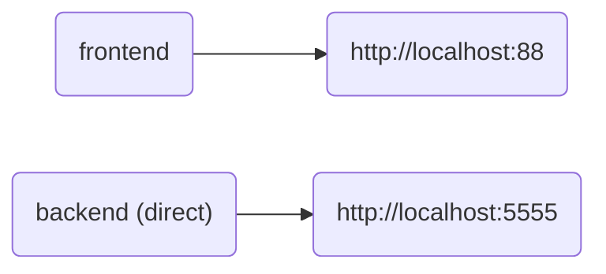

#  NFLd

* Choose an NFL team and the season schedule
* Full NFL schedule information will be displayed

---

## Compose flowchart



---

## Development stuff

### Backend:

```bash
python3 -m venv .venv
source .venv/bin/activate
cd backend
pip-compile --extra dev
pip-sync
python3 api.py &
deactivate
```

### Frontend:

```bash
cd frontend
pnpm i
pnpm run build:dev
```

---

## Docker stuff

### To build images:

```bash
# All
./build.sh

# Backend
cd backend && ./build.sh

# Frontend
cd frontend && ./build.sh
```
