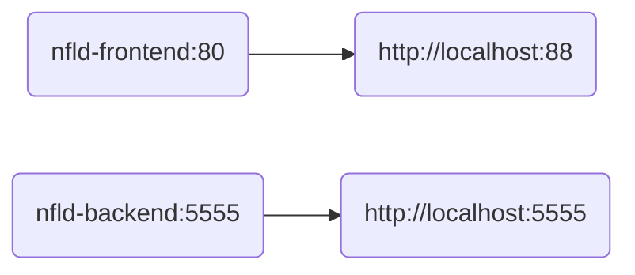

#  NFLd

> - Choose an NFL team, year, and season schedule
> - Full NFL schedule information will be displayed

---

#### Docker Compose Flow:



---

#### To build all images:

```bash
./build.sh
```

---

### Additional documentation available:

- [Frontend](./backend/README.md "Frontend")
- [Backend](./frontend/README.md "Backend")
