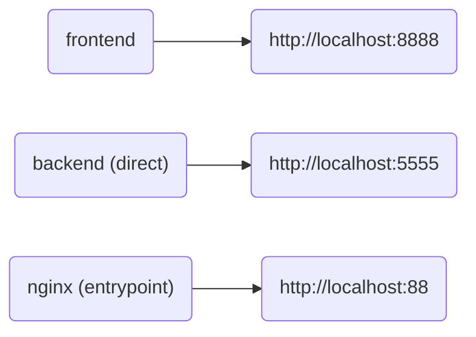

#  NFLd

* Choose an NFL team and the season schedule
* Full NFL schedule information will be displayed

# Compose flowchart



---

# Development stuff

### Backend:

```bash
python3 -m venv .venv
source .venv/bin/activate
cd backend
pip-compile --extra dev
pip-sync
python3 api.py &
deactivate
```

### Frontend:

```bash
cd frontend
pnpm i
pnpm run build:dev
```

# Docker stuff

### To build images:

```bash
# All
./build.sh

# Backend
cd backend && ./build.sh
# or
cd backend && ./Dockerfile # image only

# Frontend
cd frontend && ./build.sh
# or
cd frontend && ./Dockerfile # image only

# Nginx
cd nginx && ./build.sh
# or
cd nginx && ./Dockerfile # image only
```

# Nginx stuff

```nginx
server {
    listen 443 ssl http2;
    ssl_certificate [certificate].crt;
    ssl_certificate_key [certificate].key;
    server_name [sub].[domain].com;
    location / {
        proxy_pass http://0.0.0.0:88;
        proxy_set_header Host $http_host;
        proxy_set_header X-Real-IP $remote_addr;
        proxy_set_header X-Forwarded-For $proxy_add_x_forwarded_for;
        proxy_set_header X-Forwarded-Host $server_name;
    }
}
```
