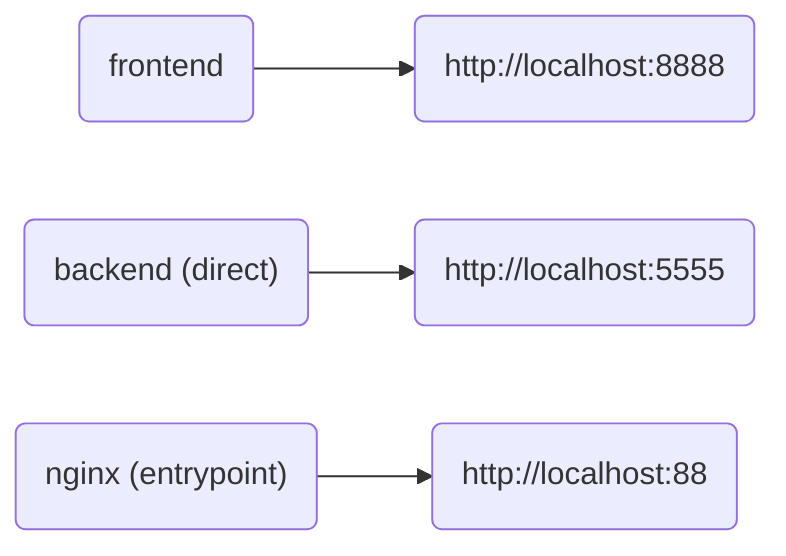

# Compose flowchart



___

# Development stuff

### Backend:
```bash
python3 -m venv .venv
source .venv/bin/activate
cd backend
pip-compile --extra dev
pip-sync
python3 api.py &
deactivate
```

### Frontend:
```bash
cd frontend
pnpm i
pnpm run dev
```

# Docker stuff

### To build images:

```bash
# All
./build.sh

# Backend
cd backend && ./build.sh
# or
cd backend && ./Dockerfile

# Frontend
cd frontend && ./build.sh
# or
cd frontend && ./Dockerfile

# Nginx
cd nginx && ./build.sh
# or
cd nginx && ./Dockerfile
```

# Nginx stuff

```nginx
server {
    include ssl_params;
    server_name [sub].[domain].com;
    location / {
        proxy_pass http://0.0.0.0:88;
        include proxy_params;
    }
}
```
