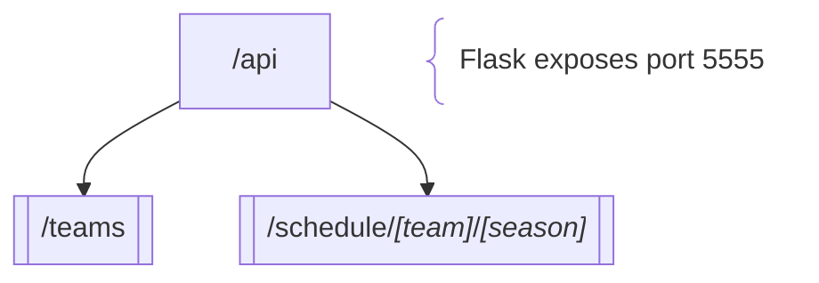

# NFLd backend flowchart



---

# NFLd stuff

### To run `api.py`:

```bash
./api.py
# or
.venv/bin/python3 api.py &
```

### To build standalone Docker image:

```bash
./build.sh
# or
./Dockerfile
```

# Python stuff

### Virtual environment:

```bash
# Activate
source .venv/bin/activate

# Deactivate
deactivate
```

### To upgrade `pip`:

```bash
pip install --upgrade pip
```

### To install `pip-tools` _(for `pip-compile`/`pip-sync`)_:

```bash
pip install pip-tools
```

### To generate `requirements.txt`:

```bash
pip-compile # reads pyproject.toml
# or
pip-compile --extra dev # includes optional dev dependencies
```

### To install dependency:

```bash
pip install [package]
```

### To uninstall dependency:

```bash
pip-autoremove [package] -y
```

### To review package versions:

```bash
pip-review
```

### To upgrade dependency:

```bash
pip-compile --upgrade --extra dev # all dependencies
# or
pip-compile --upgrade # prod dependencies
# or
pip-compile --upgrade-package [package]
```

### To sync dependencies:

```bash
pip-sync
```

### To manually lint `api.py`:

```bash
./lint.sh
```

### To run tests:

```bash
./test.sh
```
