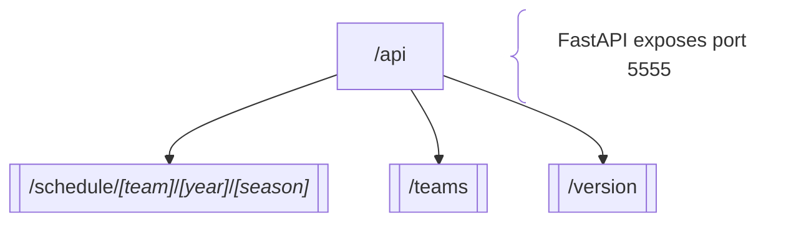

#  NFLd (Backend)

> - Choose an NFL team, year, and season schedule
> - Full NFL schedule information will be displayed

---

### 🏗️ Architecture <!-- markdownlint-disable-line MD001 -->

#### API Structure:

---

### 🛠️ Environment Management

#### Python ([uv](https://github.com/astral-sh/uv "uv") manager):

|        📋 Task         |           🔧 Command            |
| :--------------------: | :-----------------------------: |
|         Update         |        `uv self update`         |
|        Install         |  `uv python install [version]`  |
|       Uninstall        | `uv python uninstall [version]` |
|          Pin           |    `uv python pin [version]`    |
| Create/Update Lockfile |            `uv lock`            |
|   Create/Update venv   |            `uv sync`            |
| Create/Update env venv |     `uv sync --extra [env]`     |
|   Installed Versions   |        `uv python list`         |

### 📦 Dependency Management

#### Installation & Removal:

|        📋 Task        |               🔧 Command               |
| :-------------------: | :------------------------------------: |
|    Add Dependency     |           `uv add [package]`           |
|  Add env Dependency   |  `uv add --optional [env] [package]`   |
|   Remove Dependency   |         `uv remove -[package]`         |
| Remove env Dependency | `uv remove --optional [env] [package]` |

#### Maintenance & Quality:

|     📋 Task      |               🔧 Command               |
| :--------------: | :------------------------------------: |
|  Check Updates   |          `uv run pip-review`           |
|   Upgrade All    |          `uv lock --upgrade`           |
|       List       |             `uv pip list`              |
|    List Tree     |               `uv tree`                |
|    Hierarchy     |     `uv tree --package [package]`      |
| Hierarchy Parent | `uv tree --package [package] --invert` |
|   Clean Cache    |            `uv cache clean`            |

### 🧪 Development

#### Scripts:

| 📜 Script |       🔧 Command       |
| :-------: | :--------------------: |
|   Lint    | `uv run pylint api.py` |
|   Test    | `uv run behave --stop` |

#### API Deployment:

| 📋 Task |            🔧 Command (Full)            | 🔧 Command (Short) |
| :-----: | :-------------------------------------: | :----------------: |
|   DEV   | `uv run fastapi dev api.py --port 5555` |     `./api.py`     |
|  PROD   | `uv run fastapi run api.py --port 5555` |      &mdash;       |

#### Docker Deployment:

|   📋 Task   |  🔧 Command   |
| :---------: | :-----------: |
|    Full     | `./build.sh`  |
| Docker Only | `./docker.sh` |

#### Virtual Environment:

|    📜 Script    |         🔧 Command          |
| :-------------: | :-------------------------: |
|     Create      |          `uv venv`          |
| Create Specific |   `uv venv -p [version]`    |
|    Activate     | `source .venv/bin/activate` |
|   Deactivate    |        `deactivate`         |
