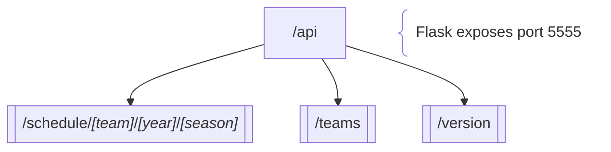

# NFLd backend flowchart



---

## API stuff

### To run `api.py`:

```bash
fastapi dev api.py --port 5555 # DEV
# or
fastapi run api.py --port 5555 # PROD
# or
./api.py &
# or
python api.py &
```

### To build standalone Docker image:

```bash
./build.sh
# or
./Dockerfile
```

# Python stuff

### uv commands:

```bash
# Update
uv self update

# List versions
uv python list

# Install
uv python install [version]

# Pin
uv python pin [version]

# Uninstall
uv python uninstall [version]
```

### uv project commands:

```bash
# Lock (creates/updates uv.lock from pyproject.toml)
uv lock
# or
uv lock --upgrade

# Sync (creates/updates .venv)
uv sync --extra dev # DEV
uv sync # PROD

# Add dependency
uv add --optional dev [package] # optional-dependencies
uv add [package] # dependencies

# Remove dependency
uv remove --optional dev # optional-dependencies
uv remove [package] # dependencies

# List packages
uv tree
# or
uv pip list

# Find package dependencies
uv tree --package [package]

# Find parent package for dependency
uv tree --package [package] --invert

# Clean cache
uv cache clean
```

### Virtual environment:

```bash
# Activate
source .venv/bin/activate

# Deactivate
deactivate
```

### To review package versions:

```bash
pip-review # venv active
# or
uv run pip-review # venv not active
```

### To manually lint `api.py`:

```bash
./lint.sh
```

### To run tests:

```bash
./test.sh
```
