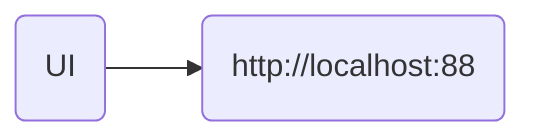
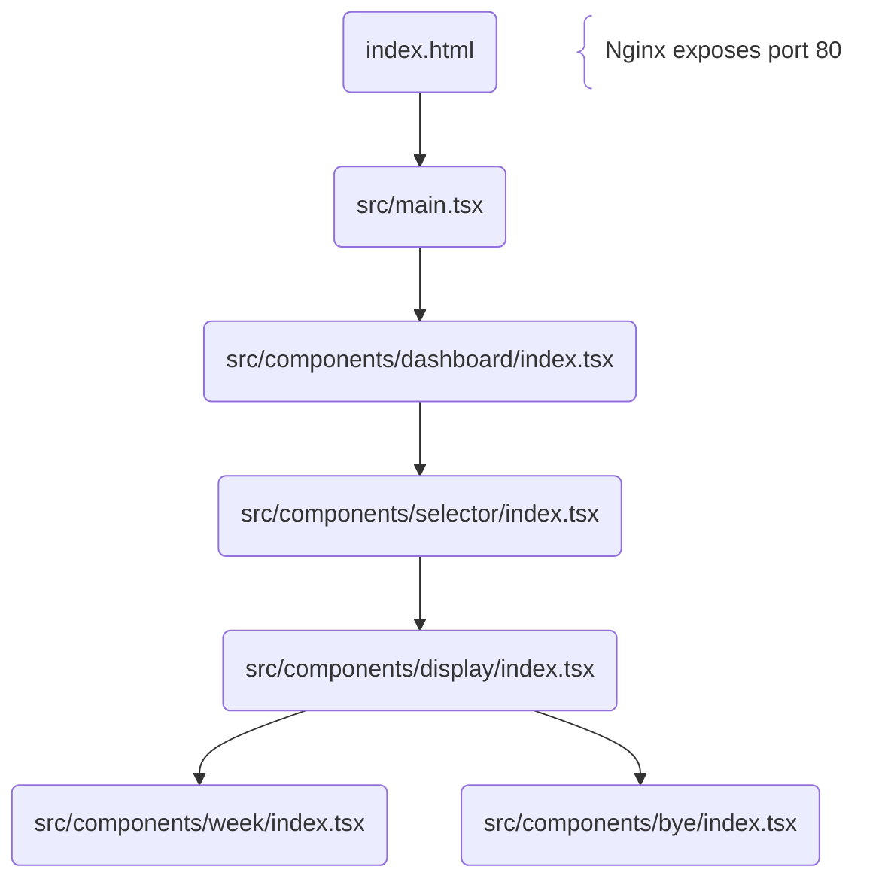

#  NFLd (Frontend)

> - Choose an NFL team, year, and season schedule
> - Full NFL schedule information will be displayed

---

### 🏗️ Architecture <!-- markdownlint-disable-line MD001 -->

#### Docker Compose Flow

---

#### React Component Hierarchy

---

### 🛠️ Environment Management

#### Node.js ([n](https://github.com/tj/n "n") manager)

|     📋 Task      |     🔧 Command     |
|:----------------:|:------------------:|
| Manage Versions  |      `sudo n`      |
| Install Specific | `sudo n [version]` |

#### NPM ([pnpm](https://github.com/pnpm/pnpm "pnpm") manager)

|   📋 Task    |          🔧 Command           |
|:------------:|:-----------------------------:|
|    Enable    |    `corepack enable pnpm`     |
|     Use      |  `corepack use pnpm@latest`   |
| Use Specific | `corepack use pnpm@[version]` |
|    Update    |         `corepack up`         |

### 📦 Dependency Management

#### Installation & Removal

|        📋 Task         |               🔧 Command (Full)                |        🔧 Command (Short)         |
|:----------------------:|:----------------------------------------------:|:---------------------------------:|
|      Install DEV       |                 `pnpm install`                 |             `pnpm i`              |
|      Install PROD      |             `pnpm install --prod`              |            `pnpm i -P`            |
|     Add dependency     |   `pnpm add --save-prod [package][@version]`   |  `pnpm add [package][@version]`   |
|   Add devDependency    |   `pnpm add --save-dev [package][@version]`    | `pnpm add -D [package][@version]` |
| Add optionalDependency | `pnpm add --save-optional [package][@version]` | `pnpm add -O [package][@version]` |
|   Add peerDependency   |   `pnpm add --save-peer [package][@version]`   |              &mdash;              |
|       Add Global       |    `pnpm add --global [package][@version]`     | `pnpm add -g [package][@version]` |
|   Remove Dependency    |            `pnpm remove [package]`             |        `pnpm rm [package]`        |

#### Maintenance & Quality

|     📋 Task     |    🔧 Command (Full)    | 🔧 Command (Short)  |
|:---------------:|:-----------------------:|:-------------------:|
|  Check Updates  |     `pnpm outdated`     |       &mdash;       |
|   Update All    |      `pnpm update`      |      `pnpm up`      |
| Update Specific | `pnpm update [package]` | `pnpm up [package]` |
| Security Audit  |      `pnpm audit`       |       &mdash;       |
|   Run Script    |   `pnpm run [script]`   |   `pnpm [script]`   |
|      List       |       `pnpm list`       |      `pnpm ls`      |
|   List Extra    |   `pnpm list --long`    |      `pnpm ll`      |
|    Hierarchy    |  `pnpm why [package]`   |       &mdash;       |

### 🧪 Development

#### Scripts

|       📜 Script        |       🔧 Command       |
|:----------------------:|:----------------------:|
|     Lint All (DEV)     |    `pnpm run lint`     |
|     Lint All (CI)      |   `pnpm run lint:ci`   |
|       Lint Biome       | `pnpm run lint:biome`  |
|        Lint CSS        |  `pnpm run lint:css`   |
|       Lint HTML        |  `pnpm run lint:html`  |
|     Lint Markdown      |   `pnpm run lint:md`   |
| Run Tests (Hot Reload) |  `pnpm run test:dev`   |
|     Run Tests (CI)     |    `pnpm run test`     |
|       Build DEV        |  `pnpm run build:dev`  |
|       Build PROD       |    `pnpm run build`    |

#### Docker Deployment

|   📋 Task   |  🔧 Command   |
|:-----------:|:-------------:|
|    Full     | `./build.sh`  |
| Docker Only | `./docker.sh` |

---

### 🛰️ Git & CI/CD

- **Pre-Commit:** Staged files are automatically linted and tested
- **Github Actions:** Lints, tests, builds, and pushes multi-architecture images to repository
  - latest
    - amd64
    - arm64
