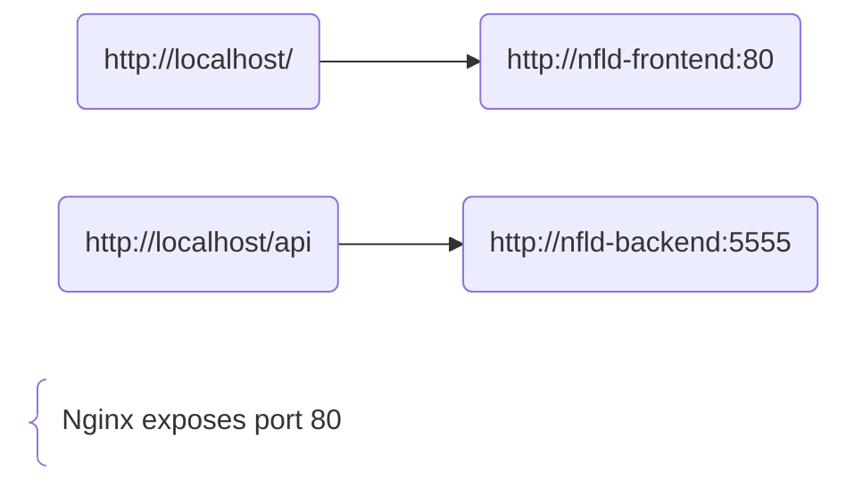

# NFLd Nginx proxy flowchart

```mermaid
flowchart LR
frontend@{shape: rounded, label: "http://localhost/"}
frontendProxy@{shape: rounded, label: "http://nfld-frontend:80"}
backend@{shape: rounded, label: "http://localhost/api"}
backendProxy@{shape: rounded, label: "http://nfld-backend:5555"}
frontend-->frontendProxy
backend-->backendProxy
port@{shape: comment, label: "&nbsp; Nginx exposes port 80"}
```
